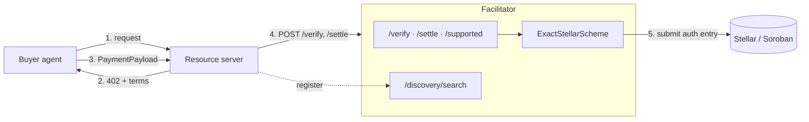

# Architecture

```mermaid
flowchart LR
    A[Buyer agent] -->|1. request| RS[Resource server]
    RS -->|2. 402 + terms| A
    A -->|3. PaymentPayload| RS
    RS -->|4. POST /verify, /settle| F

    subgraph F[" Facilitator "]
        HTTP["/verify · /settle · /supported"]
        BAZAAR["/discovery/search"]
        SCHEME["ExactStellarScheme"]
        HTTP --> SCHEME
    end

    SCHEME -->|5. submit auth entry| SOR[(Stellar / Soroban)]
    RS -.->|register| BAZAAR
```
